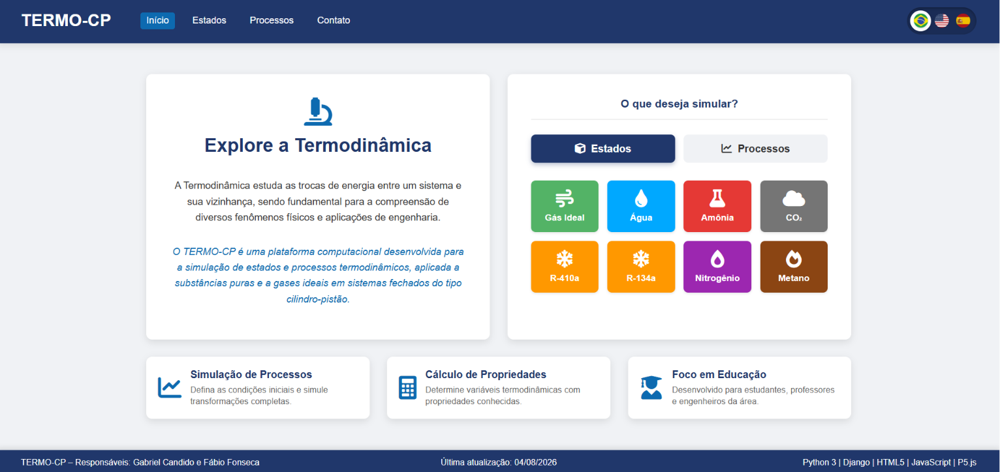

<a name="inicio"></a>
<p align="center">
  <a href="https://gcandid0.pythonanywhere.com/">
    
  </a>
</p>

<div align="center">

# TERMO-CP

### Plataforma web para simular estados y procesos termodinámicos en sistemas cilindro-pistón.

<sub><a href="./README.md">🇧🇷 Português</a> &nbsp;|&nbsp; <a href="./README.en.md">🇺🇸 English</a> &nbsp;|&nbsp; 🇪🇸 Español</sub>

<br/>

<a href="https://gcandid0.pythonanywhere.com/"></a>
<a href="https://www.djangoproject.com/"></a>
<a href="https://www.python.org/"></a>
<a href="https://p5js.org/"></a>
<a href="https://github.com/gcandid0/Termo-CP/blob/main/LICENSE"></a>

<br/>

<a href="https://github.com/gcandid0/Termo-CP/stargazers"></a>
<a href="https://github.com/gcandid0/Termo-CP/commits/main"></a>
<a href="https://github.com/gcandid0/Termo-CP"></a>
<a href="https://github.com/gcandid0/Termo-CP/issues"></a>

<br/><br/>

<a href="http://lattes.cnpq.br/6696786236047929"></a>
<a href="https://www.linkedin.com/in/gabriel-candido-235637226/"></a>
<a href="https://github.com/gcandid0/Termo-CP"></a>

</div>

<p align="center"><sub>Desarrollado en el marco de investigación académica de la <strong>Universidade Federal de Rondonópolis (UFR)</strong>, Brasil · en proceso de registro ante el INPI</sub></p>

## Índice

- [Sobre TERMO-CP](#sobre-termo-cp)
- [Idiomas](#idiomas)
- [Sustancias soportadas](#sustancias-soportadas)
- [Cómo usar](#cómo-usar)
- [Funcionalidades](#funcionalidades)
- [Stack tecnológico](#stack-tecnológico)
- [Roadmap](#roadmap)
- [Contacto](#contacto)
- [Autores](#autores)
- [Licencia](#licencia)
- [Cómo citar](#cómo-citar)
- [Contribuir](#contribuir)

---

## Sobre TERMO-CP

**TERMO-CP** es una plataforma computacional desarrollada para la simulación de **estados** y **procesos termodinámicos**, aplicada a sustancias puras y gases ideales en sistemas cerrados de tipo cilindro-pistón.

El proyecto tiene un enfoque educativo, dirigido a estudiantes, profesores e ingenieros que necesitan calcular propiedades termodinámicas y visualizar transformaciones de forma rápida e interactiva.

**Principales características:**

- **Cálculo de estados termodinámicos** - determina propiedades (P, T, v, u, h, s, x) a partir de pares de variables conocidas
- **Simulación de procesos** - condiciones iniciales y finales para transformaciones completas (isobáricas, isocóricas, isotérmicas, adiabáticas, entre otras)
- **Visualización 3D interactiva** - animación del cilindro-pistón en P5.js (WEBGL) para cada resultado
- **Informes exportables** - captura de resultados mediante html2canvas
- **Múltiples sustancias** - agua, amoníaco, CO₂, R-410a, R-134a, nitrógeno, metano y gas ideal

<br>

<div align="center">
  <a href="https://gcandid0.pythonanywhere.com/">
    
  </a>
</div>

<p align="right"><a href="#inicio">↑ volver arriba</a></p>

## Idiomas

La plataforma está disponible en tres idiomas, seleccionables desde el menú superior:

🇧🇷 Português &nbsp;|&nbsp; 🇺🇸 English &nbsp;|&nbsp; 🇪🇸 Español

<p align="right"><a href="#inicio">↑ volver arriba</a></p>

## Sustancias soportadas

| Sustancia | Estados | Procesos |
|---|---|---|
| Gas ideal | ✅ | ✅ |
| Agua | ✅ | ✅ |
| Amoníaco | ✅ | ✅ |
| CO₂ | ✅ | ✅ |
| R-410a | ✅ | ✅ |
| R-134a | ✅ | ✅ |
| Nitrógeno | ✅ | ✅ |
| Metano | ✅ | ✅ |

<p align="right"><a href="#inicio">↑ volver arriba</a></p>

## Cómo usar

> [!IMPORTANT]
> El código fuente de este repositorio está disponible solo para **visualización y estudio académico**, según la [licencia](#licencia) vigente. Para ejecutarlo localmente con fines de investigación/evaluación:

**Requisitos previos:**
- Python 3
- pip

### Instalación local

```bash
# Clona el repositorio
git clone https://github.com/gcandid0/Termo-CP.git
cd Termo-CP

# Crea y activa un entorno virtual
python3 -m venv venv
source venv/bin/activate

# Instala las dependencias
pip install -r requirements.txt

# Configura las variables de entorno (.env)
# crea un archivo .env en la raíz con:
# SECRET_KEY=<tu-clave>
# DEBUG=True

# Ejecuta las migraciones y el servidor
python manage.py migrate
python manage.py runserver
```

Accede a `http://127.0.0.1:8000/` en el navegador.

**Dependencias principales** (`requirements.txt`):

| Paquete | Versión |
|---|---|
| Django | 6.0.5 |
| asgiref | 3.11.1 |
| python-dotenv | 1.2.2 |
| sqlparse | 0.5.5 |
| tzdata | 2026.2 |

### Uso en línea

No es necesario instalar nada - accede directamente a la versión publicada:

**[gcandid0.pythonanywhere.com →](https://gcandid0.pythonanywhere.com/)**

<p align="right"><a href="#inicio">↑ volver arriba</a></p>

---

## Funcionalidades

### Simulación de estados

Introduce dos propiedades conocidas de una sustancia (presión, temperatura, volumen específico, título, etc.) y TERMO-CP calcula automáticamente las demás propiedades termodinámicas con base en tablas de referencia (p. ej., tablas B.x para el agua).

### Simulación de procesos

Define el estado inicial y el tipo de proceso (isobárico, isocórico, isotérmico, adiabático, politrópico) para obtener el estado final y los intercambios de energía (trabajo y calor) involucrados.

### Visualización del cilindro-pistón

Cada resultado incluye una animación 3D en P5.js que representa el comportamiento del pistón durante el proceso, facilitando la comprensión visual del fenómeno.

### Informes

Los resultados pueden exportarse como imagen/informe directamente desde la página, usando html2canvas.

<p align="right"><a href="#inicio">↑ volver arriba</a></p>

---

## Stack tecnológico

- **Backend:** Python 3 + Django
- **Frontend:** HTML5, JavaScript, P5.js
- **Despliegue:** PythonAnywhere
- **Configuración:** python-dotenv (`.env` con `SECRET_KEY` y `DEBUG`)

<p align="right"><a href="#inicio">↑ volver arriba</a></p>

---

## Roadmap

- [x] Cálculo de estados para 8 sustancias
- [x] Simulación de procesos con animación del pistón
- [x] Exportación de informes
- [x] Soporte para PT/EN/ES

<p align="right"><a href="#inicio">↑ volver arriba</a></p>

---

## Contacto

Preguntas, sugerencias o reportes de errores pueden enviarse mediante el [formulario de contacto](https://gcandid0.pythonanywhere.com/) de la plataforma, mediante [issues en GitHub](https://github.com/gcandid0/Termo-CP/issues) o directamente por correo electrónico.

## Autores

Proyecto desarrollado en el marco de investigación académica de la **Universidade Federal de Rondonópolis (UFR)**, Brasil:

- **Gabriel Candido Messias dos Santos** — [gabrielcandidomds@gmail.com](mailto:gabrielcandidomds@gmail.com) · [Lattes](http://lattes.cnpq.br/6696786236047929) · [LinkedIn](https://www.linkedin.com/in/gabriel-candido-235637226/)
- **Fábio Basaglia Fonseca** — [fabio.fonseca@ufr.edu.br](mailto:fabio.fonseca@ufr.edu.br)

## Licencia

TERMO-CP se encuentra en **proceso de registro ante el INPI** (oficina de propiedad industrial de Brasil), conforme a la Ley nº 9.609/1998 y la Ley nº 9.610/1998. Los derechos de autor están reservados a los autores y a la UFR.

Hasta la conclusión del registro y la definición formal de los términos de licenciamiento:

- ✅ Se permite la **visualización y el estudio** del código fuente con fines académicos, de investigación y evaluación, sin fines comerciales.
- ❌ **No se permite**, sin autorización expresa y por escrito de los autores: reproducción, distribución, modificación, obras derivadas, uso comercial, sublicencia o cesión de derechos.

El software se proporciona "tal cual", sin garantías de ningún tipo. Consulta el texto completo en [LICENSE](LICENSE).

## Cómo citar

Si TERMO-CP se utiliza en trabajos académicos, puedes citarlo como:

```
SANTOS, G. C. M. dos; FONSECA, F. B. TERMO-CP: plataforma computacional para
la simulación de estados y procesos termodinámicos. Universidade Federal de
Rondonópolis (UFR), <año>. Disponible en:
https://gcandid0.pythonanywhere.com/. Acceso en: <fecha>.
```

## Contribuir

Las contribuciones son bienvenidas, respetando los términos de la [licencia](#licencia) — en particular, contacta a los autores antes de proponer cambios de código. Consulta la guía completa en [CONTRIBUTING.md](CONTRIBUTING.md).

<p align="right"><a href="#inicio">↑ volver arriba</a></p>

---

> [!WARNING]
> TERMO-CP tiene fines educativos y los resultados deben validarse antes de aplicaciones críticas de ingeniería. El software se encuentra en proceso de registro ante el INPI y se distribuye bajo términos restrictivos — consulta la [Licencia](#licencia) antes de cualquier uso más allá de la visualización y el estudio.

<br>

<div align="center">
  
  <br>
  <sub>
    <strong>TERMO-CP</strong> · desarrollado en la <a href="https://www.ufr.edu.br/">Universidade Federal de Rondonópolis (UFR)</a><br>
    <a href="https://gcandid0.pythonanywhere.com/">Plataforma</a> ·
    <a href="https://github.com/gcandid0/Termo-CP">GitHub</a> ·
    <a href="http://lattes.cnpq.br/6696786236047929">Lattes</a> ·
    <a href="https://www.linkedin.com/in/gabriel-candido-235637226/">LinkedIn</a> ·
    <a href="mailto:gabrielcandidomds@gmail.com">Contacto</a>
  </sub>
</div>
